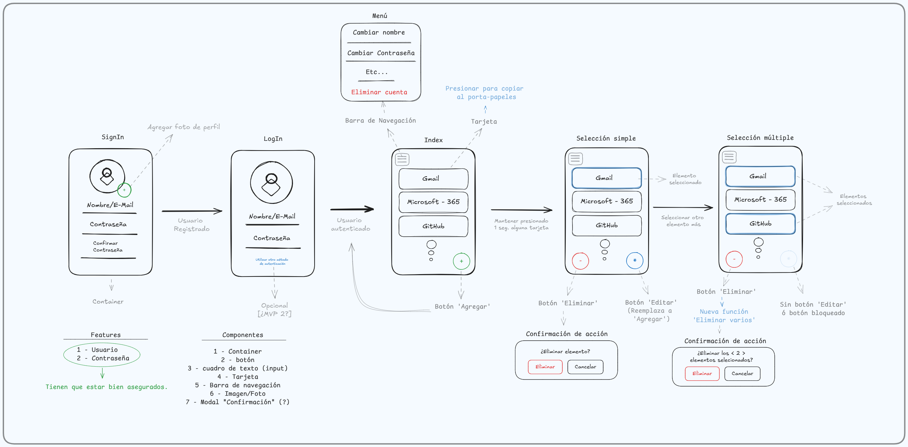

# 🛡️ SentinelKey

---

**Proyecto final de la materia Prácticas de Nuevas Tecnologías 2**  
**Comisión 2-1-C | Año 2025**  
**Instituto Tecnológico ORT**

---

## 📑 Índice

- [👥 Integrantes](#-integrantes)
- [📄 Desarrollo](#-desarrollo)
  - [💡 Introducción](#-introducción)
  - [✨ Características Principales](#-características-principales)
  - [🗂️ Estructura del proyecto](#️-estructura-del-proyecto)
  - [📐 Wireframe del proyecto (MVP)](#-wireframe-del-proyecto-mvp)
  - [🔗 Enlaces útiles](#enlaces-útiles)
- [🗃️ Uso de la base de datos](#️-uso-de-la-base-de-datos)
  - [🗂 Estructura de la Base de Datos](#-estructura-de-la-base-de-datos)
  - [📈 Esquema SQL](#-esquema-sql)
  - [👀 Observaciones](#-observaciones)
  - [🔐 Seguridad](#-seguridad)
  - [🔧 Configuración clave](#-configuración-clave)
- [⚙️ Cómo utilizar el proyecto](#️-cómo-utilizar-el-proyecto)
  - [🔐 Plantilla de archivos `.env`](#-plantilla-de-archivos-env)
  - [🌿 Ramas del proyecto](#-ramas-del-proyecto)
  - [🚀 Correr la aplicación](#-correr-la-aplicación)
- [🛫 Despliegue del proyecto](#-despliegue-del-proyecto)
  - [💻 Ejecución Local (PWA)](#-ejecución-local-pwa)
  - [🌐 Nelify](#-nelify)
- [📜 Licencia](#-licencia)
---

## 👥 Integrantes

- Juan Mateo Alonso De Armio  
- Sebastián Rosenfeld  
- Federico Wainstein  
- Fernando Sánchez

---

## 📄 Desarrollo

### 💡 Introducción

**SentinelKey** es un gestor de contraseñas simple, desarrollado como proyecto final de la materia.  
Su objetivo es brindar una solución accesible, funcional y segura para almacenar claves personales.

Este proyecto fue desarrollado con las siguientes tecnologías:

- [React](https://reactjs.org/)
- [Vite](https://vitejs.dev/) como bundler
- [Tailwind CSS](https://tailwindcss.com/) para estilos
- [Supabase](https://supabase.com/) como ppoveedor de BD y lógica backend
- [Netlify](https://www.netlify.com/) como Host y proveedor de servicios de despliegue

### ✨ Características Principales
- **Cifrado Robusto**: Utiliza algoritmos de cifrado de última generación basados en [Crypto-js](https://www.npmjs.com/package/crypto-js) para proteger tus datos sensibles.
- **Almacenamiento Centralizado**: Guarda todas tus contraseñas en un base de datos de forma segura.
- **Interfaz de Usuario Intuitiva**: Fácil de usar para gestionar tus credenciales sin complicaciones.
- **Seguridad de Acceso**: Solo tú puedes acceder a las contresñas guardadas.

### 🗂️ Estructura del proyecto

```
SentinelKey/
├── docs/
├── public/ # Archivos estáticos
├── src/
│ ├── assets/ # Imágenes, íconos y fuentes
│ ├── auth/ # Servicios de autenticación
│ ├── components/ # Componentes reutilizables
│ ├── features/ # Features pricipales
│ ├── hooks/ # Hooks personalizados
│ ├── routes/ # Definición de rutas 
│ ├── services/ # Conexión a APIs
│ ├── utils/ # Funciones de utilidad
│ ├── App.jsx # Componente raíz
│ ├── App.css # Estilos del componente raíz
│ ├── main.jsx # Punto de entrada
│ └── index.css # Estilos globales 
├── .gitignore
├── eslint.config.js
├── package.json
├── tailwind.config.js
├── vite.config.js
└── README.md
```

### 📐 Wireframe del proyecto (MVP)
---


---

### 🔗 Enlaces útiles

- [@vitejs/plugin-react](https://github.com/vitejs/vite-plugin-react) — utiliza [Babel](https://babeljs.io/) para Fast Refresh

---

## 🗃️ Uso de la base de datos

Como proveedor de base de datos se utiliza [Supabase](https://supabase.com/). **Supabase** permite manejar la lógica del backend, lo que en nuestro proyecto impacta directamente en:

- Creación y gestión de tablas  
- Manipulación de datos  
- Lógica de autenticación de usuarios  

### 🗂 Estructura de la Base de Datos

#### Tabla `usuarios`
| Campo         | Tipo               | Restricciones                     | Descripción                                  |
|---------------|--------------------|-----------------------------------|----------------------------------------------|
| `id`          | `uuid`             | `PRIMARY KEY`, `DEFAULT gen_random_uuid()` | Identificador único del usuario            |
| `created_at`  | `timestamptz`      | `NOT NULL`, `DEFAULT now()`       | Fecha de creación del registro              |
| `email`       | `text`             | `NOT NULL`, `UNIQUE`              | Email del usuario (usado para autenticación) |
| `nombre`      | `text`             | `NULL`                            | Nombre visible del usuario                   |
| `userSalt`    | `text`             | `NOT NULL`                        | Salt para operaciones criptográficas         |

#### Tabla `passwords`
| Campo              | Tipo               | Restricciones                              | Descripción                                     |
|--------------------|--------------------|--------------------------------------------|-------------------------------------------------|
| `id`              | `bigint`           | `PRIMARY KEY`, `GENERATED BY DEFAULT AS IDENTITY` | ID autoincremental                           |
| `usuario_id`      | `uuid`             | `FOREIGN KEY REFERENCES auth.users(id)`    | Relación con el usuario dueño del password     |
| `password_cifrada`| `text`             | `NOT NULL`, `UNIQUE`                       | Contraseña encriptada                          |
| `titulo`          | `text`             | `NOT NULL`                                 | Nombre descriptivo del registro                |
| `sitio_relacionado`| `text`             | `NULL`                                     | URL o app asociada (opcional)                  |
| `created_at`      | `timestamptz`      | `NOT NULL`, `DEFAULT now()`                | Fecha de creación del password                 |


### 📈 Esquema SQL
```sql
-- Tabla usuarios
CREATE TABLE public.usuarios (
  id UUID PRIMARY KEY DEFAULT gen_random_uuid(),
  created_at TIMESTAMPTZ NOT NULL DEFAULT now(),
  email TEXT NOT NULL UNIQUE,
  nombre TEXT,
  "userSalt" TEXT NOT NULL
);

-- Tabla passwords (relación 1:N con auth.users)
CREATE TABLE public.passwords (
  id BIGINT PRIMARY KEY GENERATED BY DEFAULT AS IDENTITY,
  usuario_id UUID NOT NULL REFERENCES auth.users(id),
  password_cifrada TEXT NOT NULL UNIQUE,
  titulo TEXT NOT NULL,
  sitio_relacionado TEXT,
  created_at TIMESTAMPTZ NOT NULL DEFAULT now()
);
```


### 👀 Observaciones:
1. **Relación entre tablas**:
   - `usuarios.id` es independiente de `auth.users.id` (son UUIDs diferentes)
   - `passwords.usuario_id` referencia `auth.users.id` (no `usuarios.id`)

2. **Seguridad**:
   > ⚠️ Nota: La tabla `usuarios` almacena metadatos adicionales, mientras que `auth.users` maneja la autenticación directamente en Supabase.


### 🔐 Seguridad

#### Políticas RLS
| Tabla       | Operación | Restricción                     | Descripción                             |
|-------------|-----------|---------------------------------|-----------------------------------------|
| `passwords` | Lectura   | `usuario_id = auth.uid()`       | Acceso exclusivo del dueño              |
| `passwords` | Escritura | `usuario_id = auth.uid()`       | Modificación solo por dueño             |
| `usuarios`  | Lectura   | `id = auth.uid()`               | Perfiles visibles para todos            |
| `usuarios`  | Escritura | `jwt.email = email`             | Solo auto-edición por email coincidente |

> 🔍 **Nota**: Las políticas se aplican automáticamente a todas las consultas SQL.

### 🔧 Configuración clave:
1. Se implementaron **políticas de acceso (RLS - Row Level Security)** para controlar permisos en las tablas.
2. La comunicación con la BD se realiza mediante un cliente inicializado con:
   - `URL` del proyecto Supabase  
   - `KEY` pública (almacenada como variable de entorno en el servicio de hosting)  

> 🔒 **Nota de seguridad:** Estas credenciales son sensibles y se gestionan como secretos en la configuración del host.

---

## ⚙️ Cómo utilizar el proyecto

### 🔐 Plantilla de archivos `.env`

Para realizar pruebas de forma local es necesario generar un archivo '.env' que contenga la URL y la KEY suministradas por **Supabase**. Al utilizar **Vite** en el proyecto estas varibles deben estar marcadas como se encuentran en el siguiente ejemplo.

```env
# Ejemplo de archivo .env
VITE_SUPABAE_URL= URL suministrada por Supabase
VITE_SUPABASE_ANON_KEY= SECRET_KEY suministrada por Supabase
```
### 🌿 Ramas del proyecto

- `main`: rama estable para producción
- `develop`: rama de desarrollo
- `rama-usuario`: La rama propia de cada contribuidor

### 🚀 Correr la aplicación

1. Cloná el repositorio:

```bash
git clone https://github.com/tu-usuario/sentinelkey.git
cd sentinelkey
```

2. Instalá las dependencias:

```bash
npm install
```

3. Corré el servidor de desarrollo:

```bash
npm run dev
```

---

## 🛫 Despliegue (Deployment)

### 💻 Ejecución Local (PWA)

En la rama de desarrollo (`develop`), la aplicación está configurada para funcionar como una Progressive Web Application (PWA). Una vez compilado el proyecto y ejecutado su "preview", podrás acceder a SentinelKey directamente desde tu navegador local con funcionalidades de PWA (como instalación en el escritorio).

Para ejecutar y previsualizar la aplicación localmente, sigue estos pasos:

> 🔍 **Nota**: Recuerda realizar los pasos de instalación previos. [🚀 Correr la aplicación](#-correr-la-aplicación) 

**Compilar el proyecto**:
```bash
  npm run build
```
Este comando ejecutará el script `vite build`, generando los archivos optimizados de tu aplicación.

**Iniciar la previsualización:**

```bash
  npm run preview
```
Este comando ejecutará el script `vite preview`, sirviendo la aplicación compilada en tu **localhost**.

También puedes ejecutar ambos comandos de forma secuencial con una sola línea:

```bash
  npm run build && npm run preview
```

Una vez que la previsualización esté en marcha, abre el enlace proporcionado al **localhost** en tu navegador para acceder a la aplicación con todas sus funcionalidades PWA.

### 🌐 Nelify

La aplicación está desplegada en [Netlify](https://www.netlify.com/), que ofrece:

- **Despliegue continuo:** Cada `push` a la rama `main` actualiza automáticamente la versión en producción.  
- Escalabilidad y CDN integrado  

**🔗 Enlace de producción:** [SentinelKey](https://sentinelkey.netlify.app/)  

---

## 📜 Licencia

Este proyecto se distribuye bajo la licencia MIT.

---
